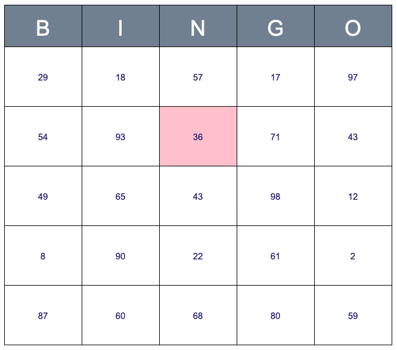

# Technical Challenge to apply at Bonitasoft

You can find, in this repository, in different folders, the same challenge with different environments.
This challenge is part of the recruitment process used at Bonitasoft to hire new member of the Process Analytics team.

## Story

You work on a new Open Source project as a frontend developer. This project is destined to the Bingo players.

Your mission, if you accept it, is to create a new library, and a demonstrator of this library to permit the Bingo players to display a new grid with random numbers, add a new token on a square, and change the background & add an interaction when a row/column is completed.

As a member of the team, we let you decide the level of completion you think is necessary to promote the library.

✨ Please share your code via GitHub:
- create a **private** repository from the [template](https://docs.github.com/en/github/creating-cloning-and-archiving-repositories/creating-a-repository-from-a-template) providing by the `pa-technical-challenge` repository.
- let the Process Analytics core team (@aibcmars @csouchet @tbouffard) access to it when you have completed the challenge

## Bingo rules
### Presentation of the game
Bingo is a game of chance played with 90 balls, numbered from 1 to 90, where the drawn numbers are announced one after the other.  \
To participate, a player must have at least 1 game card. Each player matches numbers printed in different arrangements on cards with the numbers the game host (caller) draws at random, marking the selected numbers with tiles.  \
When a player finds the selected numbers are arranged on their card in a row, they call out "**Bingo!**" to alert all participants to a winning card, which prompts the game host (or an associate assisting the host) to examine the card for verification of the win.  \
Players compete against one another to be the first to have a winning arrangement for the prize or jackpot.  \
After a winner is declared, the players clear their number cards of the tiles, and the game host begins a new round of play.

### Bingo cards
Each Bingo cards contain 25 squares arranged in 5 vertical columns and 5 side to side rows. Each space in the grid contains a different random number from 1 to 90. \
The five columns of the card are labeled '**B**', '**I**', '**N**', '**G**', and '**O**' from left to right.  \
The range of printed numbers that can appear on the card is normally restricted by column, like [this](https://generateurbingo.com/pdf/171031-generateurbingo-numeros-1-90.pdf).

### Winning combinations
A player wins by completing a row, column, or diagonal.

## Technical Overview
There are 2 parts:
- a new library which is a layer on top of the mxGraph
- a demonstrator of this library

### The library
#### Requirements
You can find, in the folder [library](./library), the same challenge with different environments. \
If you are more comfortable with another build/test tool, you are free to create your own environment based on existing ones with the following constraints:
- ES6+ or TypeScript (no Angular, no React, no Vue)
- MxGraph

You can use the IDE and the test tools that you want, but you need to provide the information necessary to install your project, to build & to test the library.

#### What already exists
To see what it's already configured, go to the readme of each environment:
- [TypeScript + Rollup](./library/ts-rollup/README.md)
- [ES + Webpack](./library/es-webpack/README.md)

#### What to do
If it's necessary (because the exercise is too long), no need to implement all the rules (management of duplicates for random numbers, all winning combinations). Make it as simple as possible.

- Add a new api method that adds a new token on a square. \
  It should be called with: `<library object>.addNewToken(“23”);` \
  The result should be something like this:
  

    
  

- Add a new api method that updates the background color of a square, without redrawing all the grid. \
  It should be called with: `<library object>.updateBackgroundColor(“16”, “Pink”);` \
  The result should be something like this:
  

    
  

- Add a new api method that adds a handler on click on square. \
  It should be called with: `<library object>.addHandler(squareLabel, (event) => {....});`
  
- Add a new api method that returns the label of the squares with no token on the same row of a specific square. \
  It should be called with: `<library object>.getLabelsWithNoTokenOnSameRow(squareLabel);` \
  The result should be something like this: `[5, 8, 3]` or `[]`

- Add a new api method that returns the label of the squares with no token on the same column of a specific square. \
  It should be called with: `<library object>.getLabelsWithNoTokenOnSameColumn(squareLabel);` \
  The result should be something like this: `[7, 2, 4]` or `[]`
  
- **Bonus**: \
  At the initialization of the library, load the MxGraph model dynamically, like done in this [example](https://jgraph.github.io/mxgraph/javascript/examples/dynamicloading.html).

#### References
- npm package of MxGraph: https://www.npmjs.com/package/mxgraph
- npm package of MxGraph type definitions: https://www.npmjs.com/package/@typed-mxgraph/typed-mxgraph
- API documentation of MxGraph: https://jgraph.github.io/mxgraph/docs/js-api/files/index-txt.html
- Examples of MxGraph: https://jgraph.github.io/mxgraph/javascript/index.html

### Demonstrator
#### Requirements
We initialize the folder [demonstrator](./demonstrator), but it's empty.

There is no specific requirement for the demonstrator. \
It can be :
- a HTML page
- a mini application
- done with StoryBook, if you are familiar with
- anything else

#### What to do
Use the previous library to demonstrate the rendering of all its functionalities.

- Display a new grid with random numbers on each square
- Add an interaction: When the user clicks on a square, a new token must appear on it.
- Add an interaction: When the user clicks on a square and the row is completed, the color of the background of the whole row must be changed.
- Add an interaction: When the user clicks on a square and the column is completed, the color of the background of the whole column must be changed.
- When the user wins: implement whatever you want to let him/her know he has just won (congratulations are welcome).
  

    
  

  
**Bonus**:
- Add an interaction: When the user clicks on a square and the diagonal is completed, the color of the background of the whole diagonal must be changed.
