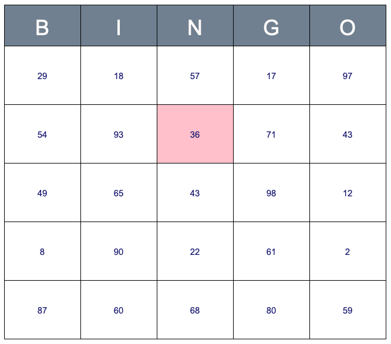
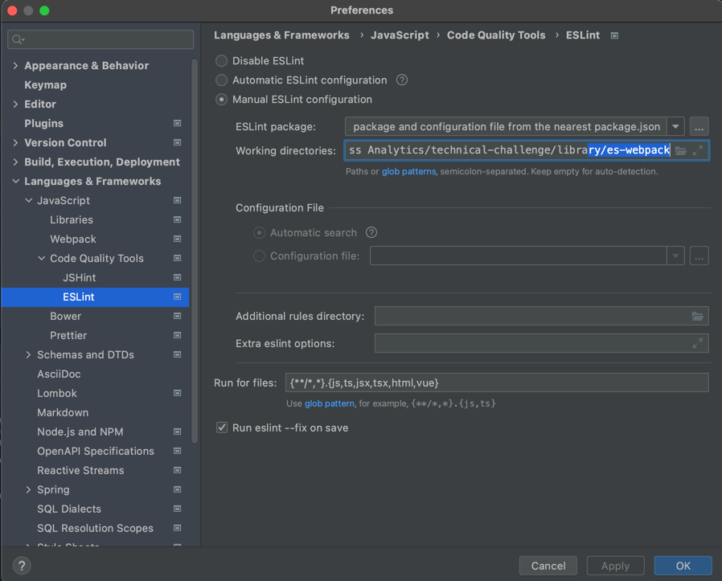

# Environment with vanilla Javascript and Webpack

## ♻️ Usage

The production bundle is available in (./dist/main.bundle.js).

### Initialize the library
```javascript
    import { Bingo } from 'main.bundle.js';
    
    // Initialize bingo-generator
    // 'bingo-container' is the id of the HTMLElement that renders the Bingo
    const bingo = new Bingo('bingo-container');
```

### Generate a new grid with random numbers on each square
```javascript
    bingo.resetGrid();
```
The result should be something like this:
  <p align="center">
    
  </p>

### Update the background color of a square, without redrawing all the grid
```javascript
    bingo.updateBackgroundColor('36', 'Pink');
```
The result should be something like this:
  <p align="center">
    
  </p>

### Register a handler on the grid
```javascript
    bingo.registerHandler(cell => {
        alert(`You click on square ${cell.value}`);
    });
```

This API could be useful for the implementation of the demonstrators. \
The current handler parameter may not be enough or the wrong one. You are free to adapt it.

## Technical part

The project is configured with Jest for the tests, Playwright & Jest-image-snapshot for the visual tests, ESLint for the code formatting.

### IDE Configuration Tips

#### IntelliJ/WebStorm
If you have a problem with IntelliJ, try to change the configuration of ESLint in the IntelliJ preferences, like:


### Commands

#### Build and start a development server
`npm run start`

A server is launched with an HTML page to test the library manually. \
Livereload/watch is enabled. \
A new tab is automatically open in the browser with the url http://localhost:8080/ and with the following rendering:


#### Format the code
`npm run lint`

#### Clean the built directories
`npm run clean`

#### Launch tests
##### All tests
`npm run test`

##### Unit tests
`npm run test:unit`

##### Unit tests + Coverage
`npm run test:unit:coverage`

##### E2E tests
`npm run test:e2e`

##### E2E tests + Coverage
`npm run test:e2e:coverage`

#### Build the _production_ bundle
`npm run build`

#### All commands
Run a clean production build with lint and test

`npm run all`
