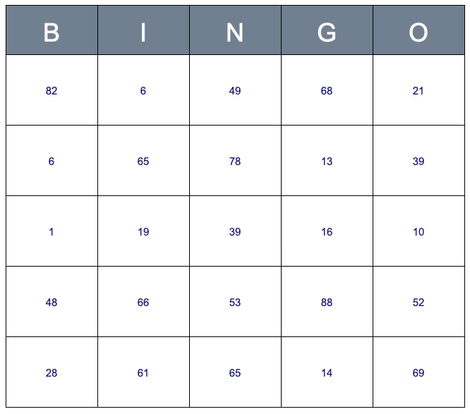

# Environment with TypeScript and Rollup

## ♻️ Usage

The production bundle is available as [ESM bundle](./dist/bingo-generator.esm.js).

### Initialize the library
```javascript
    import { Bingo } from 'bingo-generator';
    
    // Initialize bingo-generator
    // 'bingo-container' is the id of the HTMLElement that renders the Bingo
    const bingo = new Bingo('bingo-container');
```

### Generate a new grid with random numbers on each square
```javascript
    bingo.initializeGrid();
```
The result should be something like this:
  <p align="center">
    
  </p>

## Technical

The project is configured with Jest for the tests, Playwright & Jest-image-snapshot for the visual tests, ESLint for the code formatting.

## IDE Configuration Tips

### IntelliJ/WebStorm
If you have a problem with IntelliJ, try to change the configuration of ESLint in the IntelliJ preferences, like:


## Commands

### Build and start a development server
`npm run watch`

A server is launched with an HTML page to test the library manually: http://localhost:10001. \
Livereload/watch is enabled. \
You should have the following rendering:


### Format the code
`npm run lint`

### Clean the built directories
`npm run clean`

### Launch tests
#### All tests
`npm run test`

#### Unit tests
`npm run test:unit`

#### Unit tests + Coverage
`npm run test:unit:coverage`

#### E2E tests
`npm run test:e2e`

#### E2E tests + Coverage
`npm run test:e2e:coverage`

### All the previous commands
`npm run all`

### Build the _production_ bundle
Run a clean production build with lint and test

`npm run all`
