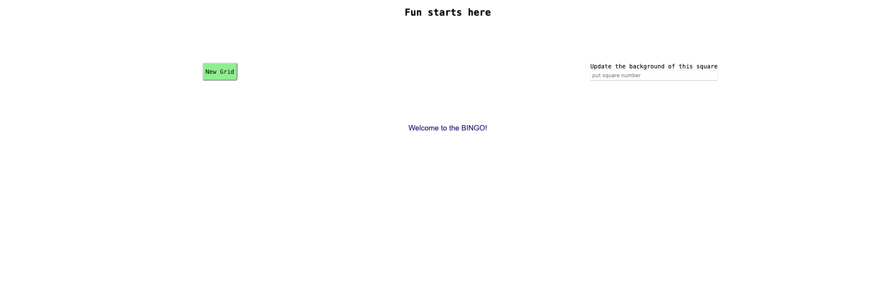

# ♻️ Usage

The project is configured with Jest for the tests, Playwright & Jest-image-snapshot for the visual tests, ESLint for the code formatting.

## IDE Configuration

### IntelliJ
If you have a problem with IntelliJ, try to change the configuration of ESLint in the IntelliJ preferences, like:

## Commands
### Build the _production_ bundle
`npm run build`

### Format the code
`npm run lint`

### Clean the built directories
`npm run clean`

### Launch tests
#### All tests
`npm run test`

#### Unit tests
`npm run test:unit`

#### Unit tests + Coverage
`npm run test:unit:coverage`

#### E2E tests
`npm run test:e2e`

#### E2E tests + Coverage
`npm run test:e2e:coverage`

### All the previous commands
`npm run all`

### Build the _development_ bundle
`npm run watch`

A server is launched with an HTML page to test the library manually: http://localhost:10001. \
You should have the following rendering:

    

